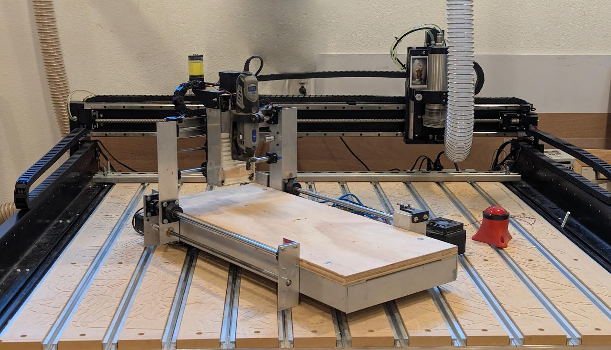
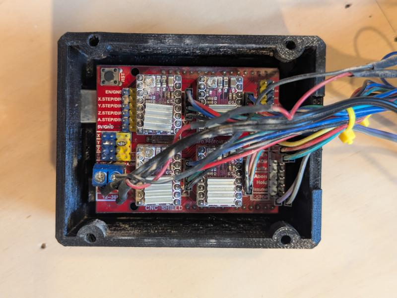
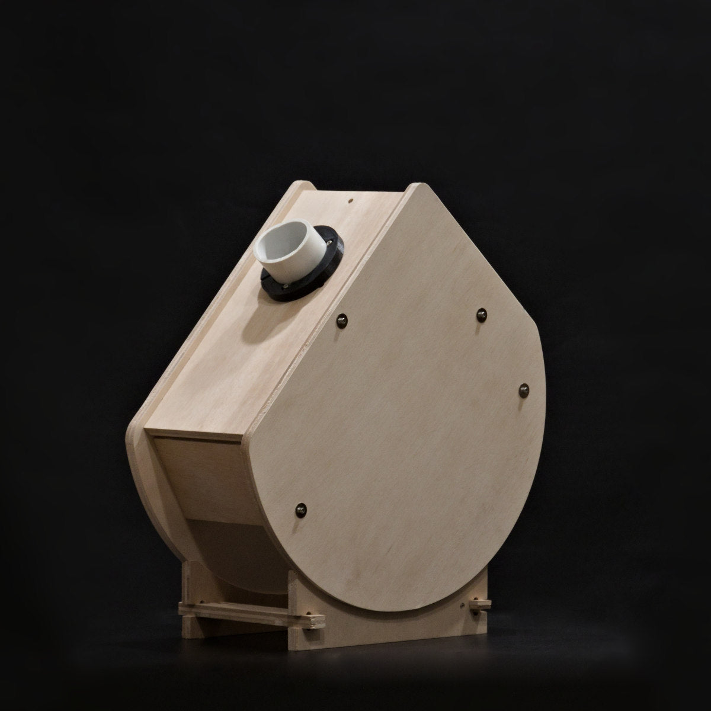
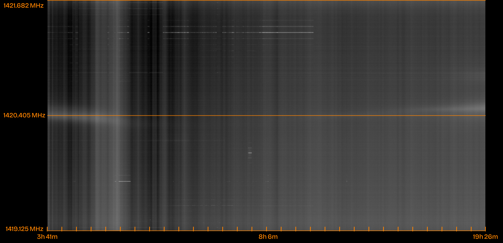
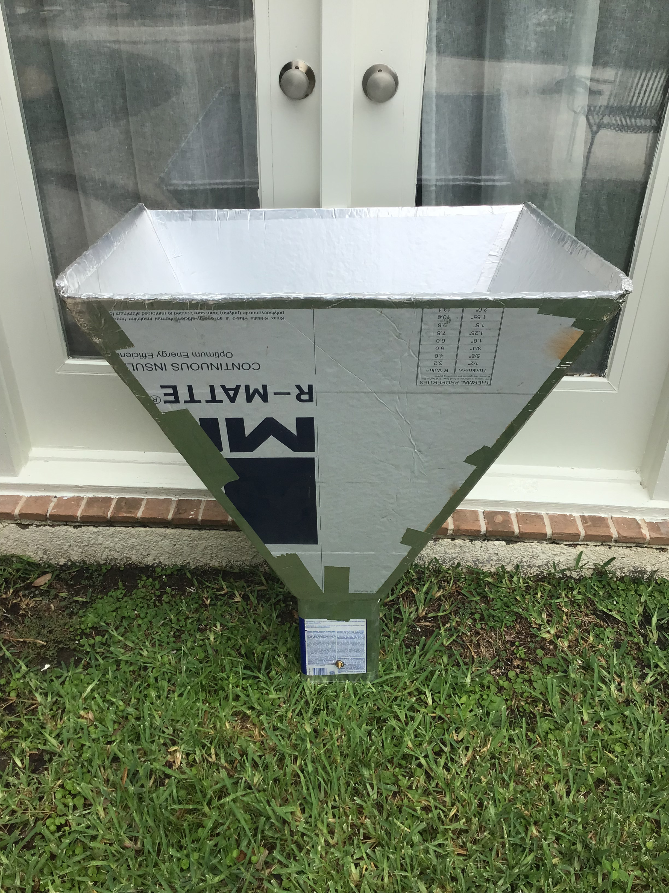
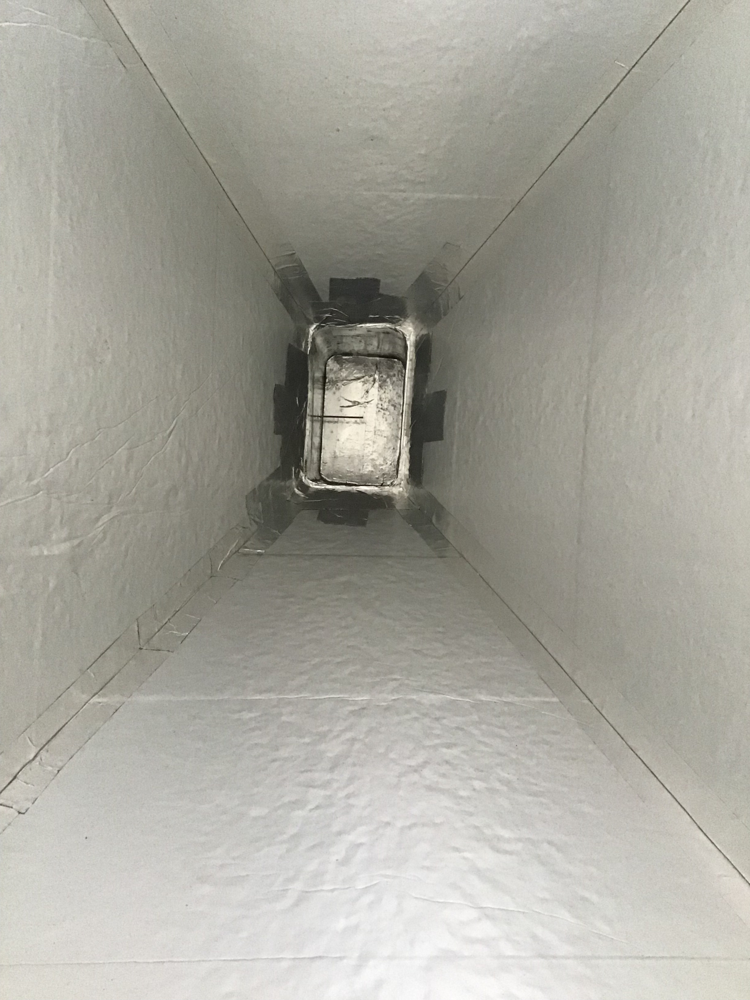
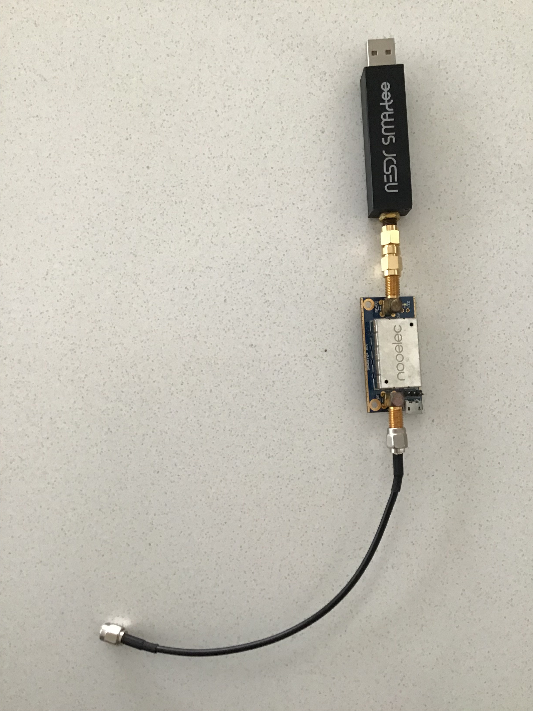
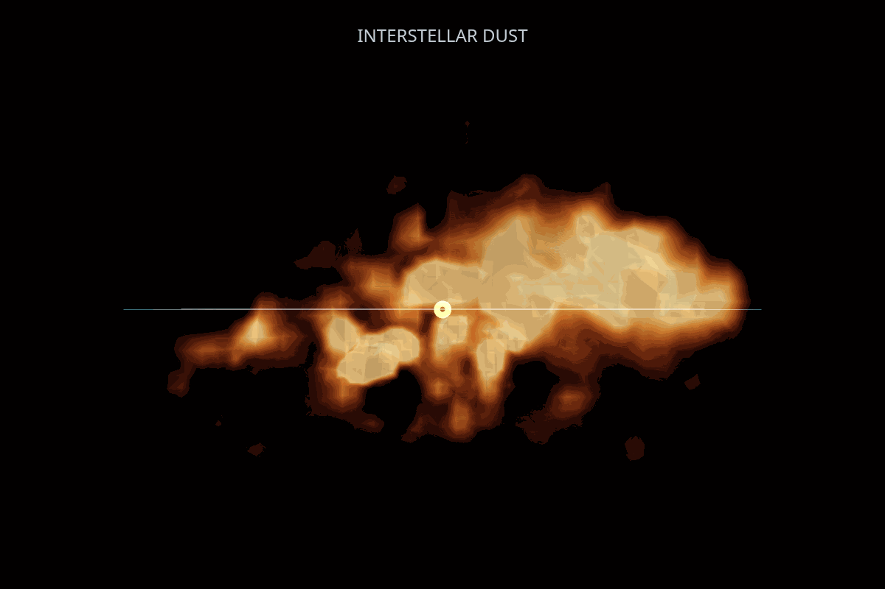
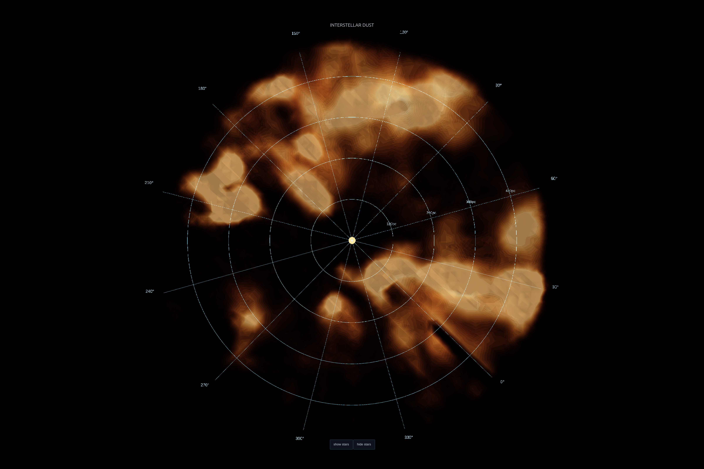
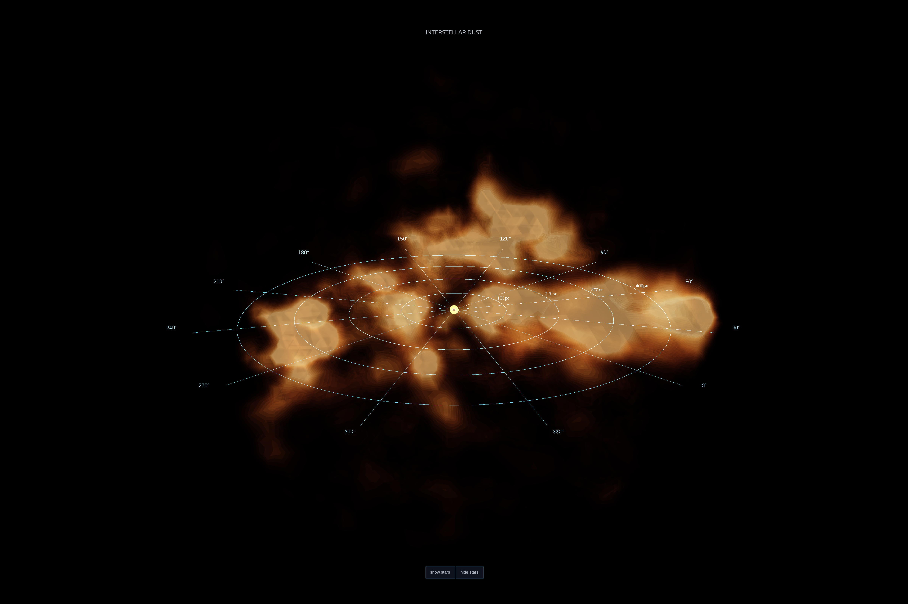

# Portfolio

**Mechanical Design & Prototyping**

CS degree · hands-on builder · fluent from CAD model through fabrication and software

Houston, TX

 

## Projects

 

### `01` &nbsp; 3-Axis CNC Router &nbsp;   

> Designed and built from scratch in 3 months. 20″ × 10″ × 4″ working envelope; cuts aluminum, acrylic, and wood.

| | |
|:---:|:---:|
|  |  |
| *Completed router with workpiece on the bed. Aluminum frame, linear rails.* | *Custom 3D-printed controller enclosure with CNC shield and stepper drivers.* |

- Aluminum extrusion frame with linear rails on all three axes
- Custom 3D-printed controller enclosure housing the CNC shield, stepper drivers, e-stop, and limit switch terminals
- Fusion 360 CAM with feeds and speeds tuned per material by test cuts
- Iterated structural parts through several failures; cracked brackets became an education in wall thickness, fillet sizing, and ribbed cross sections

 

### `02` &nbsp; Solar Projector Telescopes &nbsp;   

> Co-founded a venture to design and manufacture solar projector telescopes for the April 8, 2024 total solar eclipse. Concept to multi-unit production in three months.

*Production unit. Focusable front lens, two flat mirrors folding the optical path, eyepiece projecting the solar image onto a semi-transparent rear screen.*

- Plywood enclosure machined with multi-tool CAM; designed from day one for repeatable batch fabrication
- Folded optical path (focusable front lens → two flat mirrors → eyepiece) projects the solar disk onto a rear semi-transparent screen — inherently safe by form factor, not by filter
- Image quality target met: sunspots clearly resolved on the projected disk
- All units shipped before eclipse day

 

### `03` &nbsp; 1.42 GHz Radio Telescope &nbsp;  

> A backyard hydrogen-line detector built from foil-faced insulation board. Resolved the 21 cm H-I emission line from the Milky Way in a 16-hour transit scan.

*16-hour drift scan. Y-axis: frequency centered on 1420.405 MHz (orange marker). X-axis: time. The horizontal band is H-I emission; drift above/below the marker tracks Doppler shift from galactic rotation.*

|  |  |  |
|:---:|:---:|:---:|
| *Pyramidal horn from foil-faced polyiso panels* | *Waveguide section; probe couples to coax* | *1.42 GHz SAW-filtered LNA + RTL-SDR dongle* |

- Pyramidal horn antenna from foil-faced polyiso panels; waveguide section with coax-coupled probe
- RF chain: 1.42 GHz SAW-filtered LNA → RTL-SDR dongle
- Fixed pointing; Earth's rotation swept the beam across the galactic plane; long integration lets the H-I line emerge from thermal noise
- Drift above and below the rest frequency (1420.405 MHz) visible in the spectrogram, tracking Doppler shift from galactic rotation

 

### `04` &nbsp; 3D Map of Galactic Dust &nbsp;   
 
> From-scratch reconstruction of the dust distribution within ~500 pc of the Sun, built from Gaia DR3 photometry of ~15 million stars. End-to-end pipeline from raw archive query to interactive 3D visualization.
 

 
*120-frame rotation of the galactic dust volume. Edge-on view; looking down from above the galactic plane.*
 

| | |
|:---:|:---:|
|  |  |
| *Top-down. Polar projection at galactic plane. Sun at center, 100 pc arcs.* | *Oblique. Looking above the galactic plane toward galactic center.* |
 
- Chunked ADQL queries across 72 sky regions to work around the Gaia 3M-row response cap; retry logic and failure logging for long-running pulls; output in columnar Parquet
- Per-star color excess derived from a hand-fit blue-edge polynomial over the HR diagram (intrinsic-color baseline for reddening)
- KD-tree spatial indexing in Cartesian galactic coordinates; 3D Gaussian kernel weighting reconstructs the cumulative reddening field; centered finite differencing yields dust density
- No off-the-shelf dust-map library used
- Visualization: Plotly volumetric rendering, custom polar overlay anchored to the galactic plane, interactive HTML with toggleable star overlay, high-res stills via Kaleido, 120-frame rotation GIF
- Reproduces structural features of the published Bayestar map along a test sightline: foreground dust at ~100 pc and the rise into the Cygnus complex at ~300 pc both visible
 

## Skills & Tools

| Domain | Details |
|:---|:---|
| **CAD / CAM** | Fusion 360 (design + CAM), 3D printing |
| **Fabrication** | CNC routing, aluminum & wood, plywood machining |
| **Electronics** | Stepper drivers, CNC controllers, RF front ends, SDR |
| **Software** | Python, data pipelines, Plotly, scipy, Parquet |
| **Astronomy** | Gaia archive (ADQL), radio astronomy, photometry |

 
